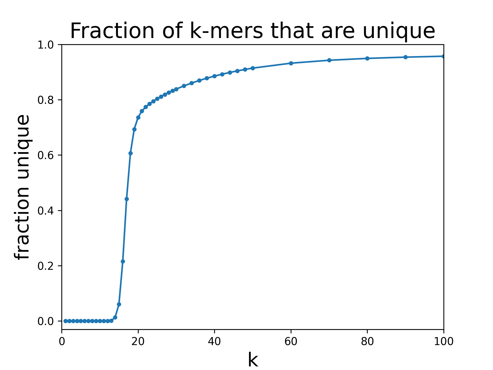
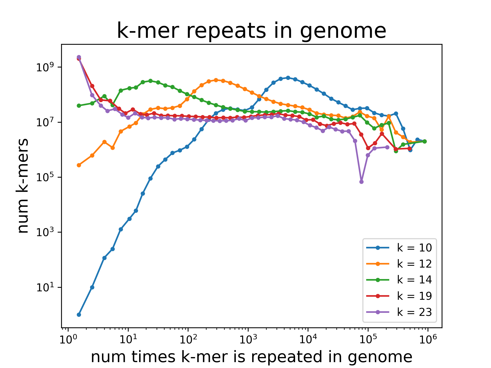

# Overview

This repository contains example calculations using the [genome-kmers](https://genome-kmers.readthedocs.io/en/latest/index.html) Python package.

# Examples

## Plot unique k-mers as a function of k

Calculate the number of unique k-mers as a function of k in the human genome. A k-mer is considered unique if it occurs exactly once.  See [Example](get_unique_kmers.ipynb).

## Plot distribution of k-mer group sizes

For all k-mers in the human genome, calculate the distribution of k-mer group sizes. The k-mer group size is defined as the number of times the k-mer sequence appears in the genome. See [Example](get_kmer_group_size_distribution.ipynb).
